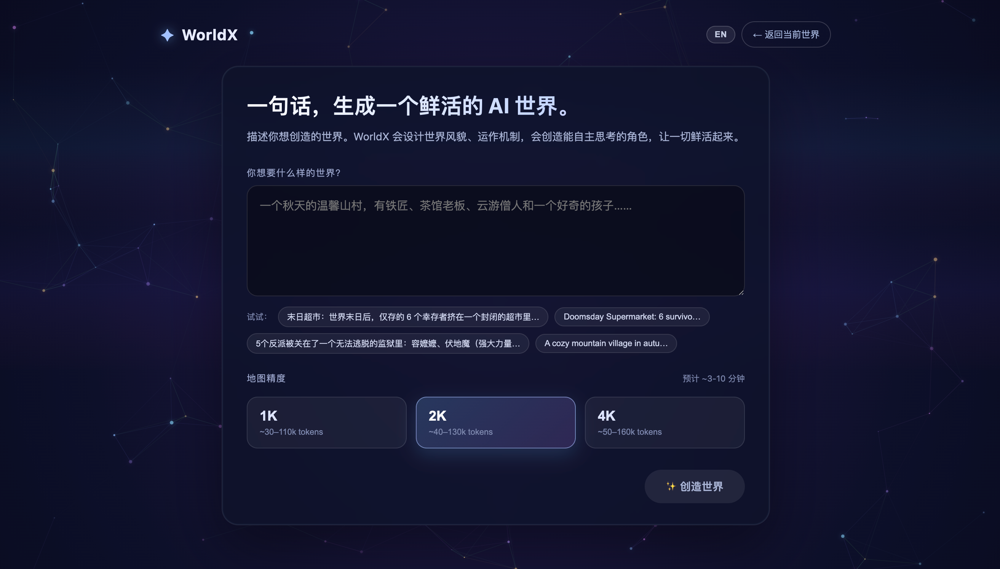
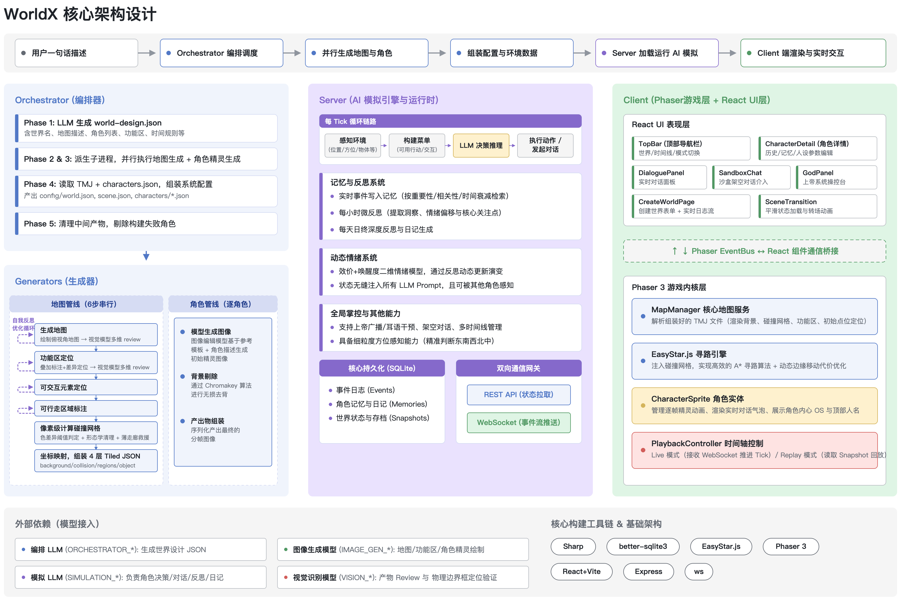

# 大规模 AI 生成世界：从单张地图到千倍量级开放世界的技术路径研究

> **摘要**：本报告基于 WorldX 项目当前的 AI 地图生成流水线，系统性地探讨在保持单图分辨率不变的前提下，将可漫游 AI 世界扩展 10 倍至 1000 倍的可行路径。报告分析了当前图像生成模型的物理限制，识别了制约规模扩展的核心技术瓶颈，提出了基于三层金字塔架构（World–Zone–Chunk）的组合方案，并以艾欧尼亚（《英雄联盟》设定中的国家级区域）为案例进行了具体设计。报告还给出了分阶段的落地路径、量化验证指标、阶梯式 A/B/C 方案，以及对未来 3-5 年模型能力演进的预测。

---

## 1. 项目目标

本项目致力于将 AI 生成的虚拟世界，从"一张 1536×1024 像素的小型场景图"扩展为"可漫游 30-50 小时的大型开放世界"，并在每一处局部保持当前画质水准。

<p align="center">
  
</p>
<p align="center"><sub>图 1.1　WorldX 当前 1× 量级地图样例（"英雄联盟：符文歧路"，96×64 tile，4K 单图）</sub></p>

<p align="center">
  
  
</p>
<p align="center"><sub>图 1.2　WorldX 当前的世界生成与角色仿真界面</sub></p>

明确的分层目标如下：

| 量级 | 体感规模 | 行业类比 |
|---|---|---|
| 1×（现状） | 一张 4K 图，约 2 分钟横穿 | 单一村庄、庙宇或街道 |
| 10× | 10 个独立 zone，每个独立 4K 图 | 一座城市的多个街区 |
| 100× | 一个 zone 内部由约 42 个 chunk 拼接 | 国家级区域，如艾欧尼亚 |
| 1000× | 10 个 100× zone 加过渡区 | 完整大陆，中等规模 RPG |

需要强调，本项目的核心追求并非"单点画面更精细"，而是"世界尺度更广阔"——在相同的每平方像素信息密度下，扩展世界的物理范围、功能区数量与可行走路径长度。

---

## 2. 现有图像生成模型的能力边界

### 2.1 当前栈

WorldX 当前使用 `google/gemini-3.1-flash-image-preview`（OpenRouter 平台上的 Nano Banana 系列模型），其稳定输出上限为 4K 档（1536×1024 像素，16:9 比例）。

### 2.2 主流模型横向对比

| 模型 | 单图最大分辨率 | 备注 |
|---|---|---|
| Gemini 3 Flash Image（现用） | 1536×1024 | 16:9，超过此尺寸输出质量显著下降 |
| Imagen 4 | 2048×2048 | Google 高质量档，延迟与成本较高 |
| GPT-Image-1（OpenAI，2025 年 4 月发布） | 1536×1024 / 1024×1536 / 1024×1024 | DALL-E 3 的迭代后继；实际数据请以 OpenAI 最新文档为准 |
| Flux 1.1 Pro Ultra | 2752×1536（约 4 MP） | 当前公开的单图分辨率 SOTA |
| Midjourney v6 + upscaler | 约 4096×4096 | 实质为先生成后超分，非原生大图 |
| SDXL / Flux.1-dev | 1024-1536 原生分辨率 | 受训练分辨率约束 |

### 2.3 物理上限的换算

当前 1536×1024 配合 16 像素瓦片，对应 96×64 = 6,144 个可行走瓦片单元。即使切换到目前公开的最高单图模型 Flux 1.1 Pro Ultra，单图最多承载约 16,000 瓦片，相当于现状的 2.5 倍。

由此得出结论：**单张图像永远无法满足 10 倍及以上的世界扩展需求**，无论选择何种模型均不可行。这一限制源自模型 VAE 训练分辨率的固有约束，并非工程优化所能突破。

因此，更大规模的世界必须由多张高分辨率图像组合而成，这是技术路径选择的唯一前提。

---

## 3. 核心技术瓶颈

世界规模扩展的真正难点，不在单张图像如何生成，而在多张图像如何组合后仍呈现为一个统一的世界。具体可归纳为以下五项瓶颈：

### 3.1 几何连续性

相邻图块边界处的道路、河流、海岸线、山脊等地理特征必须严格对齐。例如：图块 A 右边缘有一条道路通向坐标 (380, 200)，图块 B 左边缘的道路必须从 (0, 200) 准确延续。这是一个**几何与语义对齐问题**。

### 3.2 风格漂移

跨多个图块时，色彩调性、笔触风格、光照氛围、细节密度均会发生不易察觉的累积偏移。其来源可分解为三类：
- 来源 A：内容差异引起的合理变化（樱花林与火山在视觉上理应不同）
- 来源 B：模型生成随机性的累积（同一提示词在不同种子下的微差异）
- 来源 C：长提示词中风格描述被局部内容稀释

这是一个**视觉统计问题**。

### 3.3 全局路径连通性

数十个图块拼接后，必须保证从任意命名地标到另一命名地标存在连续可行走路径。当前流水线的 walkable grid 仅在单图块内部有效，缺乏跨图块连通性校验机制。

### 3.4 后处理流水线的扩展性

现有 Step 3 / 3.2 / 4 依赖视觉模型在压缩图上识别区域、元素与可行走范围。视觉模型同样存在分辨率上限，无法直接处理拼合后的巨图，必须改造为分块识别加坐标合并。

### 3.5 角色 AI 的可达性认知

character-manager 模块当前以单 zone 为认知边界。跨图块寻路、跨 zone 传送、远距感知等能力均需补齐，需引入分层的"地理记忆"机制。

---

## 4. 实现路径分析

针对上述瓶颈，存在三条互斥的基础路径与一条组合路径。

### 4.1 路径 A：单图外延（Outpainting）

**做法**：将 Step 1 改为先生成中心 4K 图，再以 img2img / outpainting 向四周延展，相邻图块共享约 20% 重叠区。后续步骤在拼合后的巨图上运行。

**评价**：改造量最小，整张图可直接作为单一 TMJ 背景；但接缝处风格漂移与道路错位严重，10× 勉强可行，100× 必然出现明显拼接痕迹；视觉模型在巨图上的识别能力不足，必须重写后处理。

### 4.2 路径 B：Zone 图（Zone-graph）

**做法**：将世界拆分为 N 个独立 zone，每个 zone 完整运行现有流水线生成自有 4K 地图与 TMJ；zone 之间通过传送门、关隘、港口等机制连接。

**评价**：现有流水线复用率约 90%，10× 实现门槛低；运行时只加载当前 zone，性能优良；但单 zone 的内容容量受限于单图分辨率，无法独立支撑国家级区域规模。

### 4.3 路径 C：分层瓦片（Overworld + Chunk）

**做法**：先生成一张低分辨率的世界总览图（overworld），用以固定区域拓扑、地理走向与功能区位置；随后让模型按总览图的局部裁切为每个图块生成高分辨率详图。

**评价**：能够支撑 100× 量级，无缝感最强；但工程复杂度跃升，需要双层提示词体系、跨图块约束、流式加载机制；模型按骨架严格作画的能力有限，调试成本高。

<p align="center">
  
</p>
<p align="center"><sub>图 4.1　WorldX 当前单图流水线架构图（作为新方案改造的起点）</sub></p>

### 4.4 推荐方案：B + C 组合（三层金字塔架构）

单独使用路径 B 时单 zone 容量不足；单独使用路径 C 时整体复杂度过高。**两者组合恰好对应游戏行业成熟的分层世界设计范式**：

| 层级 | 单元 | 数量 | 生成策略 | 行业类比 |
|---|---|---|---|---|
| World 世界层 | Zone | 约 10 个加过渡区 | 拓扑图加传送门连接（路径 B） | 《巫师 3》中的 Velen / Novigrad / Skellige |
| Zone 区域层 | Sub-region (Chunk) | 约 42-100 个 | overworld 骨架加 chunk 续写（路径 C） | Velen 内部的村庄、林地、沼泽 |
| Chunk 子区层 | 当前 4K 地图 | 1 个 | 现有完整流水线 | 单一村庄、庙宇、街道 |

该架构的关键优势在于：每一层只解决该层的问题。边界对齐难题被局限在 chunk 之间的接缝（局部、可控），而非整张巨图。

---

## 5. 各路径的优劣与上下限

| 路径 | 保守预期下限 | 最佳情况上限 | 工程量 | 关键依赖 |
|---|---|---|---|---|
| A 单图外延 | 10× 视觉勉强 | 30× 不破功 | 1-2 周 | 现有模型可用 |
| B 单纯 Zone-graph | 10× 容易达成 | 约 30 zone（受设计师产能限制） | 1-2 周 | 现有模型可用 |
| C 单纯 Overworld+Chunk | 100× 可行 | 1000× 理论上限 | 约 3 个月 | 必须迁移到 Flux/SDXL 加 ControlNet |
| B+C 组合 | 100× 稳定 | 1000-10000× | 2-4 个月 | 同 C |

---

## 6. 推荐架构的具体实现

### 6.1 三层数据结构

```
World 层（拓扑图，非图像）
├── zones[]：每个 zone 的 ID、名称、位置、相邻 zone
├── portals[]：zone 间的传送门（船、传送阵、关隘）
└── transitions[]：可选的过渡区（窄长连接走廊）

Zone 层（一张低分辨率骨架图加 chunk 网格）
├── overworld.png（约 1024×1024，semantic segmentation 风格）
├── chunks[N×M]
│   ├── 每个 chunk 是当前 4K 图的尺寸
│   ├── 每个 chunk 知道自己在 overworld 上的裁切位置
│   └── 每个 chunk 知道 4 个邻居的 ID
├── named_landmarks[]：约 12 个命名地标
└── chunk_graph：连通性图（chunk 之间是否能走通）

Chunk 层（复用当前流水线）
├── 输入：本块提示词加 overworld 局部裁切（ControlNet）加 style anchor
├── 流水线：Step 1 至 Step 6
└── 输出：当前 TMJ 格式
```

### 6.2 案例：艾欧尼亚的具体设计

以《英雄联盟》设定中的艾欧尼亚（Ionia / First Lands）为示例，按 100× zone 规格设计。该区域在原作中为面积接近一个亚洲大陆的灵能群岛，具备多省份、多生态、多修行流派、战后复苏等丰富设定，是理想的验证案例。

> **完整规划与实现细节请参见独立文档**：[`ionia-zone-design.md`](./ionia-zone-design.md)，本节仅给出概览。

**12 个命名地标设计：**

| 序号 | Sub-region | 类型 | 主题 | 关键英雄 |
|---|---|---|---|---|
| 1 | 纳沃利圣坛 | 中心 hub，3 chunk | 战后废墟与重建中的圣殿 | 卡尔玛、艾瑞莉娅 |
| 2 | 加林港 | 商港，2 chunk | 繁忙码头、走私酒馆 | 凯隐、瑟提 |
| 3 | 修桑稻田 | 田园，1 chunk | 风、剑、悲剧故乡 | 亚索、永恩 |
| 4 | 修真寺 | 山顶，1 chunk | 御风剑道修行场 | 永恩、亚索 |
| 5 | 影流秘窟 | 隐秘崖，1 chunk | 暗杀者议会 | 劫、慎、阿卡丽 |
| 6 | 均衡神殿 | 灵林，2 chunk | 锦魁三守护本部 | 慎、阿卡丽、凯南 |
| 7 | 巴尔猴王城 | 山城，2 chunk | Vastayan 树屋部落 | 悟空 |
| 8 | 翁玛梦林 | 异色森林，2 chunk | 梦境领域 | 莉莉娅、佐伊 |
| 9 | 灵息渡口 | 神域裂缝，1 chunk | 永恒花海、灵会节场 | 妖姬 |
| 10 | 羽族秘巢 | 林冠，1 chunk | Vastayan 反抗军 | 霞、洛 |
| 11 | 战痕渔村 | 南海岸，1 chunk | 诺战旧伤口、平民群落 | NPC 主导 |
| 12 | 流浪戏团 | 移动式，1 chunk | 不固定位置的小型集会 | 萨勒芬妮 |

**地理骨架原则**：南北长、东西窄的群岛主体；东侧海岸面向 Valoran 大陆；中央山脊贯穿北至南；3 条主河贯穿森林至海岸；2 处灵能裂缝点缀。

**30 个过渡 chunk** 包括：森林小径、山间栈道、海边石滩、稻田阡陌、灵能空地、战火废墟、温泉群、瀑布峡谷、竹林迷宫等，每个均为"路过型"区域，但承载 1-2 处可交互元素。

### 6.3 体感规模估算

按当前 4K 地图玩家约 1-2 分钟横穿估算：

- 现状（1×）：约 2 分钟看完
- 艾欧尼亚 zone（100×）：东西穿越约 8-10 chunk × 1.5 分钟 ≈ 15 分钟横穿，全境探索 3-5 小时
- 完整符文之地（1000×）：30-50 小时主线漫游

该体量大致对应《八方旅人》《天国：拯救》量级，略小于《巫师 3》。

---

## 7. 潜在风险与挑战

| 风险编号 | 风险描述 | 影响层级 |
|---|---|---|
| R1 | 几何对齐失败：模型不严格遵循 overworld 骨架 | Chunk 层 |
| R2 | 风格累积漂移：30 个 chunk 后视觉差异肉眼可见 | Zone 层 |
| R3 | 接缝可见：相邻 chunk 边界处颜色、纹理、笔触突变 | Chunk 接缝 |
| R4 | 后处理不可扩展：视觉模型无法处理拼合巨图 | 流水线 |
| R5 | 跨 chunk 寻路失效：角色 AI 缺乏分层导航能力 | 运行时 |
| R6 | 失败 chunk 重生成破坏邻居一致性 | Chunk 层 |
| R7 | 设计师产能瓶颈：内容产出本身的工程量 | 项目层 |

---

## 8. 解决方案

### 8.1 几何连续性（针对 R1、R3）

| 方法 | 强度 | 说明 |
|---|---|---|
| 共享语义骨架（ControlNet） | ★★★★ | 全局一致性的核心，必备 |
| 重叠带加 img2img 续写 | ★★★ | 接缝处的局部微调 |
| 接缝后处理修补（inpainting） | ★★ | 兜底机制 |
| 路径优先生成 | ★★★★ | 道路先钉死，内部再填充；最可靠但工程量大 |

**推荐组合**：ControlNet 加接缝处局部 img2img 加 inpainting 兜底。

### 8.2 风格一致性（针对 R2）

| 方法 | 效果 | 说明 |
|---|---|---|
| IP-Adapter 风格锚定图 | ★★★★★ | 最有效，必备 |
| 风格 token 锁死（提示词头部） | ★★★ | 零改动量，立即可用 |
| 种子锁定加同模型同采样器 | ★★ | 顺手实施 |
| 后处理调色板对齐 | ★★★ | 兜底，建议约 30% 强度避免"塑料感" |

**推荐组合**：IP-Adapter（必备）加风格 token（必备）加轻度调色板对齐（兜底）。

### 8.3 路径连通性（针对 R5）

- 在 zone 层维护 chunk_graph：节点为 chunk，边为"是否有连续可行走 tile 跨越共享边界"
- chunk 生成完成后执行 flood fill 校验，要求所有命名地标位于同一连通分量
- 不连通的 chunk 自动触发重生成，附加强约束（如"左边缘 y=128-256 区间必须为道路"）

### 8.4 后处理可扩展性（针对 R4）

- Step 3 / 3.2 / 4 改造为按 chunk 处理，结果坐标加上 chunk offset 后合并
- 跨 chunk 的大型功能区（如横跨 4 chunk 的城市）使用专门的 big-region 标注，识别后做坐标合并

### 8.5 失败 chunk 重生成（针对 R6）

- 每个 chunk 记录"边缘约束"：上下左右各 16 像素条带的 ground truth
- 重生成时将这 4 条带作为 img2img 的固定区域（mask out），仅允许模型重新绘制内部

---

## 9. 落地路径

| 阶段 | 周期 | 核心交付物 | 风险点 |
|---|---|---|---|
| **阶段 0**：现状 | 已完成 | 单图 4K 流水线稳定运行 | — |
| **阶段 1**：栈迁移 | 2-3 周 | 从 Gemini 迁移至 Flux.1-dev，验证不退化；接入 ControlNet 与 IP-Adapter | Flux 中文提示词支持弱，可能需要翻译层 |
| **阶段 2**：3×3 原型 | 2-3 周 | 选纳沃利圣坛加 8 个邻接 chunk 做最小验证；跑通连续性、漂移、校验、重生成完整闭环 | 验证标准：人工评估 9 chunk 拼合"是一张地图"而非"9 张图" |
| **阶段 3**：完整艾欧尼亚 | 4-6 周 | 扩展至 42 chunk；命名地标加过渡 chunk 双类模板；连通性自动校验；后处理 chunk 化 | 内容产能 |
| **阶段 4**：World 层 | 3-4 周 | world-design schema 加 zones[] 与 portals[]；TMJ 加 portal 类型；character-manager 跨 zone 切换 | 双 zone 验证 |
| **阶段 5**：千倍世界 | 按需 | 完整 10 zone；按视野流式加载；端到端 30+ 小时游戏体验测试 | 内容产能而非技术 |

总周期估计：阶段 1-4 约 3-4 个月。阶段 5 受限于内容产能而非技术问题。

---

## 10. 意义与价值

### 10.1 技术意义

- AI 内容生成从"单元素"走向"系统级"。当前图像模型已能生成单张精美图，但生成"内部一致的复杂世界"是真正的下一个技术台阶。
- 建立从自然语言提示到可玩世界的端到端管线，包括拓扑规划、几何对齐、风格锚定、后处理识别、运行时支撑。
- 方法论具备跨领域复用价值：任何"由众多视觉单元构成、需要全局一致性的系统"均可借鉴，例如室内设计、城市规划可视化、漫画分镜等。

### 10.2 创作意义

- 实现从"AI 帮助生成单一场景"到"AI 协助构建完整世界"的质变。
- 显著降低世界级内容创作的门槛，使原本仅 3A 工作室能完成的 100 小时 RPG 体量内容，进入小团队甚至个人开发者的能力范围。
- 释放长尾创意。每位有想法的玩家或创作者都能将构思中的世界转化为可漫游的实体。

---

## 11. 未来展望

### 11.1 5 年内可见的应用

- 个人级开放世界游戏：独立开发者用一周时间生成一个 30 小时游戏的初版。
- 教育级历史复现：将"宋代开封城"等历史场景作为可漫游教育内容。
- 小说与动漫 IP 即时游戏化：粉丝输入小说设定，AI 自动产出可玩世界。
- 城市规划与房地产可视化：AI 实时将规划文档转化为可漫游沙盘。

### 11.2 10 年内的可能形态

- 持续生长的世界：世界并非一次性生成，而是随玩家行为动态扩张（边界处自动生成新 chunk）。
- 跨世界互通：不同玩家的世界由 AI 协商生成"边境过渡区"实现连接。
- 完全语音/对话式创作：用户自然语言描述需求，30 分钟内世界生成完毕并可玩。

---

## 12. 商业价值

### 12.1 直接变现路径

| 模式 | 客群 | 备注 |
|---|---|---|
| B2C 创作工具 | 独立游戏开发者、同人作者 | 订阅制，类比 Unity/Roblox |
| B2B SaaS | 中小游戏工作室外包内容生成 | 按 chunk 计费 |
| IP 授权加玩家共创 | 拳头、米哈游、暴雪 | 官方授权下的"扩展宇宙"生成 |
| 教育与文旅 | 博物馆、文旅项目、历史教育 | 一次定制，长期使用 |
| 企业培训沙盘 | 安全演练、城市应急、军事推演 | B 端高客单价 |

### 12.2 隐性价值

- **训练数据壁垒**：每个生成的世界即一份"提示词到世界"的高质量配对数据，长期积累形成数据护城河。
- **平台效应**：用户在工具中创建的世界越多，工具价值越高，类比 Roblox 与 Minecraft 的 UGC 飞轮。
- **AI Agent 生态切入点**：生成的世界本身就是 AI agent 的训练与演化环境，可让 LLM 角色在 AI 生成的世界中自主活动。

### 12.3 估值锚点参考

- Roblox 市值约 500 亿美元，核心商业模式为"用户共创世界加平台分成"。
- Inworld AI（AI NPC 提供商）估值约 5 亿美元。
- WorldX 路径在概念上接近"Roblox 加 Inworld"的合体，并叠加 AI 内容生成的成本优势。

---

## 13. 可执行项目清单

### 13.1 短期（验证阶段）

- Flux 加 ControlNet 加 IP-Adapter 接入现有流水线
- 3×3 chunk 原型验证
- 接缝量化校验工具
- Demo 视频：从提示词到可漫游艾欧尼亚的 90 秒展示

### 13.2 中期（6-12 个月，产品化）

- 提供 Web 工具，自然语言描述世界，30 分钟内生成可漫游 zone
- 完整艾欧尼亚加德玛西亚双 zone demo
- 玩家共享市场（生成的世界可被他人探索）

### 13.3 长期（1-3 年，生态化）

- 多人共玩：多个玩家的 AI 角色在同一世界共生
- 主题宇宙：与 IP 方合作，官方监督下的"扩展宇宙"生成
- 跨模态融合：图、文、音、物理仿真完整融合的世界

---

## 14. 验证计划

### 14.1 阶段 2（3×3 原型）的四项硬指标

| 检查项 | 测试方法 | 通过标准 |
|---|---|---|
| 接缝几何对齐 | 取相邻 chunk 边缘 16 像素条带，计算 SSIM 与像素 L2 距离 | SSIM > 0.85 |
| 路径连通性 | 拼合 9 chunk 的 walkable grid，从中心格做 flood fill | 所有 chunk 至少一个 tile 与中心连通 |
| 语义一致性 | 让 Gemini Pro Vision 检查接缝两侧 64×64 区域，判断"是否一致" | 12 条接缝中至少 9 条 LLM 判定一致 |
| 风格一致性 | 提取每 chunk 的 VGG 特征与 LAB 色彩直方图，计算 9 chunk 间方差 | 方差小于单 chunk 内部噪声的 2 倍 |

第三项（LLM 语义检查）尤为关键。它能识别人类一眼可见但传统计算机视觉难以捕捉的不一致，例如"左侧为茶馆，右侧突变为赛博朋克"。

### 14.2 主观评估

招募 5 位非项目相关人员盲测拼合图，提问"这是一张完整地图还是若干图拼接而成"。通过标准为至少 3 人判定"完整"。

---

## 15. ABC 阶梯方案

### 15.1 方案 A：保守路径（仅 B 路径，10× 目标）

**做法**：不引入新模型，在现有 Gemini 栈上实现 zone-graph，10 个独立 zone 加传送门。

| 维度 | 指标 |
|---|---|
| 周期 | 1-2 个月 |
| 投入 | 1 人月 |
| 上限 | 10× 容易达成；约 30 zone 后受设计产能限制 |
| 适用场景 | 优先输出可演示产品，用于融资、招聘、市场试水 |

### 15.2 方案 B：标准路径（B+C 组合，100× 目标，推荐）

**做法**：栈迁移到 Flux 加 ControlNet 加 IP-Adapter，构建三层金字塔，完成完整艾欧尼亚加一个邻接 zone。

| 维度 | 指标 |
|---|---|
| 周期 | 3-4 个月 |
| 投入 | 2-3 人月 |
| 上限 | 100× 稳定，可向 1000× 扩展 |
| 适用场景 | 真正建立技术壁垒、开启商业化路径 |

### 15.3 方案 C：激进路径（B+C 组合加持续生长加多人共玩，1000× 目标）

**做法**：在方案 B 基础上加运行时世界生长（玩家走到边界自动生成新 chunk）、多角色 AI 共生、玩家共创市场。

| 维度 | 指标 |
|---|---|
| 周期 | 6-12 个月 |
| 投入 | 5-8 人月 |
| 上限 | 理论无穷，受云算力与存储成本约束 |
| 适用场景 | 作为公司核心产品长期投入 |

**建议路径**：A 至 B 至 C 渐进推进。A 阶段验证市场，B 阶段建立技术壁垒，C 阶段构建生态。

---

## 16. 模型能力演进的预测

### 16.1 短期（1 年内）

- Flux 2.0 与 SDXL 后继模型：单图分辨率有望达到 4K-6K，但"巨图无缝"仍非原生支持。
- ControlNet 演进：多模态条件输入（语义、深度、边缘、风格、文本）一体化。
- IP-Adapter 升级：风格锚定能力增强，跨 chunk 漂移问题部分缓解。
- 专门的 tile-aware 模型：可能出现专为"分块生成"训练的模型，条件包含邻居边缘信息。

**对本方案的影响**：路径 C 的复杂度可能下降 30%，但三层金字塔架构仍然必要。

### 16.2 中期（2-3 年）

- 原生 8K-16K 单图：Imagen / Flux 路线可能突破，单 zone 可能不再需要分块。
- Video-to-Map 模型：直接输入"漫游视频"，输出可游玩世界。
- 3D 原生生成：从 2D 俯视图升级到 3D 体素或网格世界，整个技术栈重构。

**对本方案的影响**：100× zone 可能可由单图完成，但 1000× world 仍需金字塔。**护城河从"分块技术"转移到"世界设计与语义编排"**。

### 16.3 长期（3-5 年）

- 持续生长式生成：模型直接支持"在已有图像边界处续写"的原生能力。
- 物理、视觉、行为统一模型：单一模型同时负责场景外观、碰撞、AI 行为。
- 参数化世界：极少量提示词（少于 100 字）即可描述一个 1000× 世界的种子。

**对本方案的影响**：今天搭建的流水线可能大部分被替代，但**"如何分层组织语义、几何、风格"的设计哲学不会过时**。

### 16.4 投资判断

本项目的核心赌注在于：在 1-3 年的窗口期内，"多张图组合成大世界"是开发者必须自行解决的问题；当模型原生支持时，先发的工具、数据、品牌护城河已经建立。

---

## 17. 衍生研究方向

### 17.1 跨 chunk 的角色行为一致性

- 角色 AI 的"地理记忆"如何分层
- 跨 zone 时角色身份与状态如何持久化
- AI 角色在无玩家观察时如何自主活动

### 17.2 玩家行为驱动的世界演化

- 玩家在某 chunk 频繁活动是否触发该 chunk 内容增生
- 玩家"破坏"某地标后，后续生成如何反映这一历史

### 17.3 多模态世界

- 音频生成（环境音、NPC 对话语音）的 chunk 化方案
- 物理碰撞、流体仿真、天气系统的 chunk 化
- "时间维度"chunk：同一地理位置的"白天 / 黑夜 / 雨天 / 雪天"作为 chunk 变体

### 17.4 共创与共享协议

- 玩家 A 生成的 zone 如何与玩家 B 的 zone 相邻
- 跨用户世界的"过境"机制
- 内容审核与 IP 侵权检测的自动化

### 17.5 评估学

- "一个世界质量如何"的客观指标体系（探索覆盖率、信息密度、风格统一度、行走可达率）
- 自动化的世界质量打分模型
- 玩家行为日志反哺世界改进

### 17.6 训练数据回流

- 每个生成的世界即一份高质量"提示词到世界结构"的配对数据
- 利用累积数据微调"WorldX 专属模型"
- 长期可能从"使用通用模型"转向"自有模型加通用模型混合"

### 17.7 与 LLM Agent 框架的融合

- AI 生成的世界作为 Agent 的训练沙盒
- 世界中的 NPC 由多个 LLM 实例协作扮演
- 玩家、AI 角色、世界三方互动的完整生态

### 17.8 离线与边缘部署

- 100× 世界能否完全在玩家本地生成
- 量化模型加移动端 GPU 是否能够支持
- 端云协同的世界生成架构

---

## 附录：关键代码引用

| 主题 | 文件路径 |
|---|---|
| 当前主流水线入口 | `generators/map/src/index.mjs` |
| 单图生成与自评审循环 | `generators/map/src/steps/step1-generate-map.mjs` |
| 功能区识别 | `generators/map/src/steps/step3-resolve-designed-regions.mjs` |
| 可交互元素识别 | `generators/map/src/steps/step3.2-locate-elements.mjs` |
| 可行走区域 | `generators/map/src/steps/step4-walkable-areas.mjs` |
| TMJ 输出 | `generators/map/src/utils/tmj-builder.mjs` |
| 图像模型客户端 | `generators/map/src/models/gemini-flash-img.mjs` |
| 分辨率配置 | `generators/map/src/utils/generation-config.mjs` |
| 地图生成提示词 | `generators/map/prompts/step1-map-generation.md` |

完整产物示例：`output/worlds/world_2026-04-29T10-37-25/map/`（"英雄联盟：符文歧路"案例，96×64 tile，4K 单图）。

---

*本报告基于 WorldX 项目当前架构与公开资料编写，旨在为大规模 AI 生成世界这一前沿方向提供可执行的技术路径与商业判断框架。*
